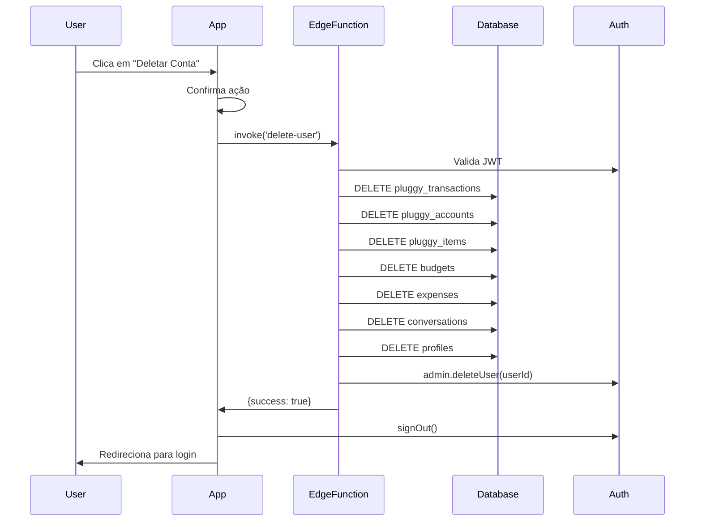

# Delete User Edge Function

Esta Edge Function deleta completamente um usuário e todos os seus dados do sistema, incluindo a conta de autenticação.

## Funcionalidade

A função executa as seguintes operações em ordem:

1. **Valida autenticação** - Verifica se o usuário está autenticado
2. **Deleta dados nas tabelas** (respeitando foreign keys):
   - `pluggy_transactions` (depende de `pluggy_accounts` e `expenses`)
   - `pluggy_accounts` (depende de `pluggy_items`)
   - `pluggy_items`
   - `budgets`
   - `expenses`
   - `conversations`
   - `profiles`
3. **Deleta usuário do auth.users** - Remove completamente a conta de autenticação

**IMPORTANTE:** A ordem é crucial para respeitar as foreign keys e evitar erros de constraint violation.

## Segurança

- ✅ Requer autenticação via JWT
- ✅ Cada usuário só pode deletar sua própria conta
- ✅ Usa Service Role Key para operações administrativas
- ✅ Validação de sessão antes de qualquer operação

## Como Usar

### Do App (TypeScript)

```typescript
const {
  data: { session },
} = await supabase.auth.getSession();

if (!session) {
  throw new Error('Not authenticated');
}

const { data, error } = await supabase.functions.invoke('delete-user', {
  headers: {
    Authorization: `Bearer ${session.access_token}`,
  },
});

if (error) {
  console.error('Error deleting user:', error);
  return;
}

// User deleted successfully
await supabase.auth.signOut();
```

### Resposta de Sucesso

```json
{
  "success": true,
  "message": "User and all data deleted successfully"
}
```

### Resposta de Erro

```json
{
  "error": "Failed to delete user",
  "message": "Error message here"
}
```

## Deploy

```bash
# Deploy da função
supabase functions deploy delete-user

# Ver logs
supabase functions logs delete-user
```

## Configuração

A função precisa ser declarada no `supabase/config.toml`:

```toml
[functions.delete-user]
verify_jwt = true
```

**`verify_jwt = true`** é importante para garantir que apenas usuários autenticados possam chamar a função.

## Variáveis de Ambiente Necessárias

As seguintes variáveis são automaticamente fornecidas pelo Supabase:

- `SUPABASE_URL` - URL do projeto Supabase
- `SUPABASE_ANON_KEY` - Chave pública (anon key)
- `SUPABASE_SERVICE_ROLE_KEY` - Chave admin (service role key)

## Diferença da Abordagem Anterior

### ❌ Abordagem Antiga (Código do App)

```typescript
// Deletava dados manualmente no app
await supabase.from('expenses').delete().eq('user_id', user.id);
await supabase.from('profiles').delete().eq('id', user.id);
// ... etc

// ❌ Não conseguia deletar auth.users (permissão negada)
```

**Problema:** O usuário continuava existindo em `auth.users`, permitindo login novamente com as mesmas credenciais.

### ✅ Nova Abordagem (Edge Function)

```typescript
// Chama Edge Function com permissões admin
await supabase.functions.invoke('delete-user', {
  headers: {
    Authorization: `Bearer ${session.access_token}`,
  },
});
```

**Solução:** A Edge Function tem permissões de Service Role e pode deletar o usuário de `auth.users` completamente.

## Fluxo Completo



## Testando Localmente

```bash
# Iniciar Supabase local
supabase start

# Deployar função localmente
supabase functions deploy delete-user --no-verify-jwt

# Testar a função
curl -i --location --request POST 'http://localhost:54321/functions/v1/delete-user' \
  --header 'Authorization: Bearer YOUR_JWT_TOKEN' \
  --header 'Content-Type: application/json'
```

## Logs e Debug

```bash
# Ver logs em tempo real
supabase functions logs delete-user --tail

# Ver logs específicos de um período
supabase functions logs delete-user --since=1h
```

## Limitações

- A função **não pode ser desfeita** - uma vez executada, todos os dados são permanentemente deletados
- Requer que o usuário esteja autenticado
- Não há recuperação de dados após a deleção

## Data de Criação

- **Criada**: 2026-01-04
- **Deployada**: 2026-01-04
